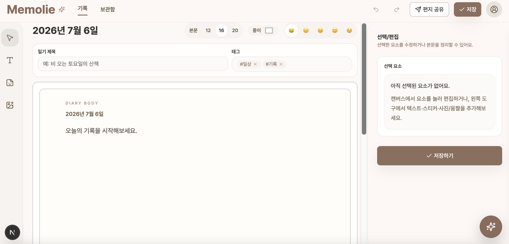
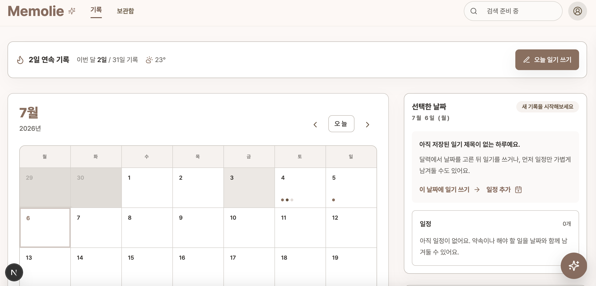

<a href="https://diary-ku.vercel.app" target="_blank">
  
</a>

<h1 align="center">Memolie 📔</h1>

<p align="center">
  감정을 기록하고, AI가 과거 일기를 근거로 함께 회고해주는 디지털 다이어리 웹앱<br/>
  <br/>
  <a href="https://diary-ku.vercel.app"><b>🔗 라이브 데모 바로가기</b></a><br/>
  <sub>회원가입 없이 홈의 <b>"테스트 계정으로 시작"</b> 한 번으로 전체 기능 체험</sub>
</p>

<p align="center">
  <code>홈 캘린더 → 캔버스 에디터 → 저장/복원 → RAG 채팅 → 편지형 공유 → 보관함 검색</code><br/>
  <sub>하나의 흐름으로 이어지는 단독 설계·구현 프로젝트 · 76개 모듈 / 약 9,000줄</sub>
</p>

<br/>

## 🛠 기술 스택

<p align="center">
  
</p>

| 영역 | 사용 기술 |
| :--- | :--- |
| **Frontend** | Next.js 15 App Router · React 19 · TypeScript |
| **Styling** | Tailwind CSS v4 · custom UI primitives |
| **Editor** | Tiptap · Pointer Events 기반 캔버스 아이템 조작 |
| **Backend** | Supabase Auth · Postgres · pgvector |
| **AI** | Voyage AI(임베딩) · Groq / Llama 3.3-70B(채팅) |
| **External** | GIPHY API · Cloudflare Workers AI |
| **Infra** | GitHub Actions · Vercel |

<br/>

## 📸 스크린샷

| 홈 캘린더 | 캔버스 에디터 |
| :---: | :---: |
|  |  |

<br/>

## ⭐ 핵심 성과

- **다이어리 UX 전 구간을 단독 설계·구현** — 자유 배치형 캔버스 에디터부터 RAG 채팅·편지형 공유·검색까지.
- **과거 일기 근거 회고형 RAG 채팅 구축** — Voyage 임베딩 + pgvector 유사도 검색 + Groq 스트리밍 응답을, 저장 UX를 막지 않는 best-effort 파이프라인으로 연결.
- **공유 시점 스냅샷 발행 구조 설계** — 원본을 나중에 수정해도 이미 보낸 편지 링크는 발행 당시 상태를 그대로 유지.

<br/>

## ✨ 핵심 기능

| 기능 | 설명 |
| :--- | :--- |
| 🗓 **홈 캘린더** | 날짜별 기록 상태·감정 흐름을 확인하고 해당 날짜 에디터로 진입 |
| 🎨 **캔버스 에디터** | 본문·텍스트 박스·이미지·GIF를 캔버스에 자유 배치 (줌·드래그·리사이즈·경계 제한) |
| 💬 **AI 회고 채팅** | 질문과 유사한 과거 일기를 검색해 컨텍스트로 주입, LLM 스트리밍 응답 (RAG) |
| ✉️ **편지형 공유** | 발행 시점 스냅샷을 별도 저장해 읽기 전용 공유 링크 생성 |
| 🔎 **보관함 검색** | 제목·태그·감정·본문·날짜 가중치 랭킹 + URL query 동기화 필터 |

<br/>

## 🧩 기술적 의사결정

각 선택으로 감수한 트레이드오프까지 함께 정리했습니다.

| 선택 | 이유 · 트레이드오프 |
| :--- | :--- |
| **전용 백엔드 없이 Supabase 직접 호출**, 시크릿 필요한 것만 API Route | 유지비·배포 복잡도를 줄이고 키 노출 지점 최소화. 대신 신뢰 경계를 RLS에 의존 |
| **캔버스 조작을 라이브러리 없이 Pointer Events로 구현** | 줌 좌표 역변환·경계 clamp를 직접 통제. 구현 비용은 늘지만 엣지 케이스를 라이브러리에 안 기댐 |
| **임베딩을 저장과 분리한 best-effort 후처리** | "기록은 반드시 저장된다"를 AI 의존성보다 우선. 드물게 검색 누락 가능 |
| **공유 링크를 발행 시점 스냅샷으로 분리** | 원본 편집이 이미 보낸 링크에 반영되지 않도록 보장. 데이터는 중복 저장 |
| **LLM을 OpenAI 호환 인터페이스로 호출** | 프로바이더 교체 시 코드 변경 최소화. 벤더 고유 기능은 포기 |

<br/>

## 🗂 프로젝트 구조

```
src/
├─ app/          # 라우트 진입 · 조합 (App Router)
├─ features/     # 화면별 상태 · 상호작용 · 저장 흐름
│  ├─ home/      #   캘린더 홈
│  ├─ editor/    #   캔버스 에디터
│  ├─ chat/      #   RAG 채팅
│  ├─ share/     #   편지형 공유
│  ├─ archive/   #   보관함 검색
│  └─ auth/
├─ components/   # 재사용 UI 프리미티브
└─ lib/          # 공용 유틸 · 외부 서비스 경계
```

feature-first 폴더링으로 화면별 상태·저장 흐름을 분리하고, 페이지 파일에는 조합만 남겼습니다.

---

<details>
<summary><strong>📋 상세 기능 · 아키텍처 · 기술적 문제 해결</strong></summary>

<br/>

### 아키텍처 하이라이트
- `useEditorState`, `useEditorPersistenceActions` 등 커스텀 훅으로 복잡한 편집 상태와 저장 흐름을 UI 렌더링 로직에서 분리했습니다.
- 홈/보관함에서 공통으로 쓰는 `DiaryEntrySummary` 뷰모델로 DB row를 화면 친화적인 읽기 모델로 변환했습니다.
- `vitest`로 저장 흐름, 본문 변환, 보관함 검색, 캘린더 계산 로직을 단위 테스트했습니다.

### 기술적 문제 해결
- **줌 상태 좌표 보정** — 확대/축소 상태에서 포인터 좌표가 실제 요소 위치와 어긋나는 문제를, Pointer Events 기반 드래그·리사이즈 로직을 직접 구현해 해결했습니다. 포인터 이동량을 현재 줌 배율로 보정하고 `clamp`로 요소가 캔버스 경계를 벗어나지 않게 제한했습니다.
- **편집 상태 분리** — 요소 목록·선택 상태·수정 여부(dirty)가 여러 컴포넌트에 분산되는 문제를 `useEditorState` 훅으로 핵심 상태와 변경 액션을 모아 해결했습니다.
- **공유 스냅샷 발행** — 공유 링크가 원본을 실시간 참조하면 이후 편집이 반영되는 문제를, 공유 생성 시점의 제목·본문·배경·꾸미기 요소를 별도 스냅샷으로 저장해 해결했습니다.
- **검색 랭킹 품질** — 본문에 우연히 단어가 포함된 기록이 과다 노출되는 문제를, 제목·태그·감정·본문·날짜를 인덱스로 분리하고 필드별 가중치 랭킹을 적용해 개선했습니다. 검색·필터 상태는 URL query와 동기화했습니다.
- **임베딩 중복 호출 제어** — 같은 저장 이벤트가 임베딩 API를 여러 번 호출하지 않도록, 수동/자동 저장 모두 저장 성공 후에만 `persistSession` 반환값으로 임베딩을 트리거하고 best-effort로 처리(실패 시 1회 재시도)했습니다.

### 후속 확장
- **AI 스티커** (Cloudflare Workers AI): 한국어 프롬프트 번역 + 랜덤 변주로 생성 품질을 개선하는 파이프라인. 현재 데모에서는 비활성.
- **감정 통계(`stats`)**: 기록 데이터 기반 감정 흐름 시각화. MVP 범위에서 분리해 헤더에 미노출.

</details>

<details>
<summary><strong>⚙️ 실행 · 배포</strong></summary>

<br/>

### 실행 방법
```bash
cp .env.example .env.local
npm install
npm run dev
```

`.env.local` 설정값:
```env
# Supabase
NEXT_PUBLIC_SUPABASE_URL=
NEXT_PUBLIC_SUPABASE_ANON_KEY=

# AI (RAG 채팅)
VOYAGE_API_KEY=        # 임베딩 — https://www.voyageai.com
GROQ_API_KEY=          # LLM 채팅 — https://console.groq.com

# 외부 서비스
NEXT_PUBLIC_CF_WORKER_URL=   # Cloudflare Workers AI (AI 스티커)
NEXT_PUBLIC_GIPHY_API_KEY=

# 테스트 계정 (로그인 화면 자동 입력)
NEXT_PUBLIC_TEST_ACCOUNT_EMAIL=
NEXT_PUBLIC_TEST_ACCOUNT_PASSWORD=
```

### 품질 확인
```bash
npm run lint
npm run typecheck
npm run test
npm run build
```

### 배포
GitHub Actions의 `CD - Vercel` workflow를 수동 실행합니다. (`Actions` 탭 → workflow 선택 → `Run workflow` → ref 입력, 기본값 `main`)
필요 Secrets: `VERCEL_TOKEN`, `VERCEL_ORG_ID`, `VERCEL_PROJECT_ID`

</details>

## 📚 문서
- [아키텍처 가이드](docs/ARCHITECTURE.md) · [AI 채팅 RAG 설계](docs/AI_CHAT_RAG.md) · [보관함 검색 알고리즘](docs/ARCHIVE_SEARCH_ALGORITHM.md) · [향후 확장 계획](docs/FUTURE_ENHANCEMENTS.md)
